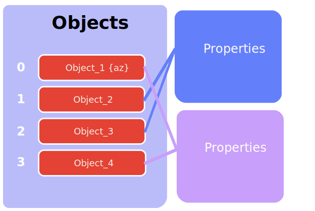

---

title: Первый объект всегда будет первым
description: Свойства – это как чувства у человека, или лучше сказать приобретенные черты для характера

---

 <nav id="navi"> <!-- js --> </nav>

# Азъ объектъ

	Программирование
	
### Первый объект

Эта страница есть наш первый объект, к которому и нужно привязать переменную
`$az`.

В нашем примере будет участвовать объект, который будет иметь **свойства**.
Свойства – это как чувства у человека, или лучше сказать приобретенные черты для характера.

Если человеку сказать: - ты умный, то он возрадуется о себе самом хорошим
настроением. В противном случае, все будет наоборот – он опечалится. Это свойство простого человека, которые вызываются словом.

Таким образом получается то, что объект есть не что иное как набор свойств,
которые можно получать от этого объекта.
 
> Объект узнать легко, он **ОКРУЖЕН** какими-нибудь скобками, сейчас так: `[$object]`.

Программирование требует повышенной внимательности (педантичности) ко всем
символам. Поэтому вы заметили, что наш объект, заключенный в скобы является
переменной. Об этом было договорено в [соглашении](az-peremennaya) об именовании переменных для данного повествования.
Обратите внимание на последовательность чтения материала. Если вы читаете в первый
раз и дошли до места ссылки, то вам нужно перейти по ссылке. Такой прием
генерирует программное мышление. Программа всегда выполняется последовательно
(шаг за шагом) ничего не пропуская.

Здесь вы оказались подобно программе перейдя по ссылке на текущую страницу и
прочли написанный выше текст. Если вы будете игнорировать данный метод обучения,
то вам понадобится больше времени для освоения данного материала.

### Подъитожим и вернемся к переменной `az`.

**Объект** – это куча переменных у которых есть свойства и ими можно пользоваться!!!

[…возврат](az-peremennaya)

 

[…назад](az-assets.md)•||||||•||||||•[далее…](az-peremennaya.md)

 

